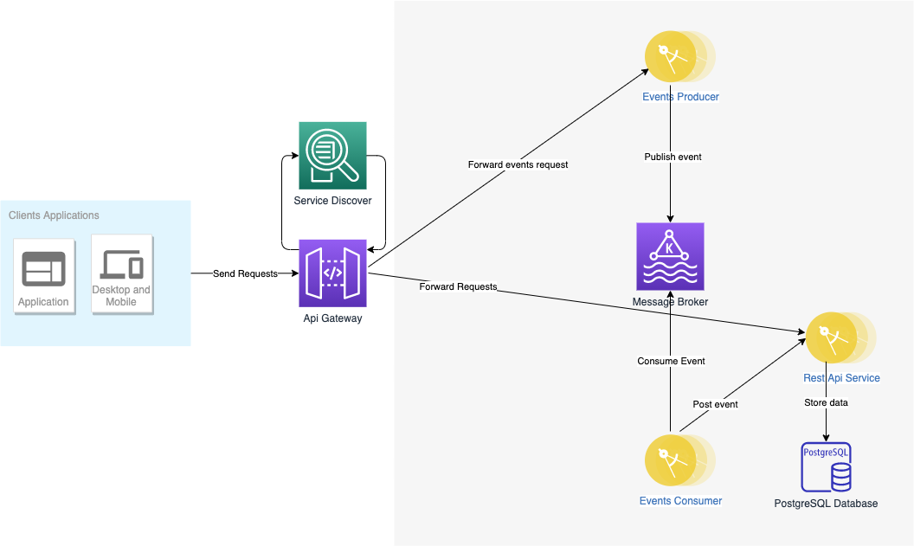

# Problem Description
In this challenge the purpose is to develop a License Plate Review (LPR) backend service for allowing authorized users to review and label poorly recognized photos with the correct license plate number. It should be also possible to monitor the review process, i.e. check a specific review or filter review processes accordingly the review status. The system should consume photos from a message broker of your choice. When testing you should publish photos in the respective topic and verify that it is correctly consumed.
# Solution Architecture


## 1. Api Gateway (Spring Cloud Api Gateway)
Provide externall communication to the publics endpoints. The clients will request to Api Gateway and it will redirect all the requests to the needed microservice.

## 2. Service Discover (Eureka)
Service where all microservice instances will register themselves and the client or API gateway will connect for identifying the location of the service instance and routing the request to it.

## 3. Message Broker (Kafka)
Message broker where the photos will be published.

## 4. Events Producer (Spring boot/Kafka)
Microservice where clients will connect to publish photos to the Message Broker

## 5. Events Consumer (Spring Boot/Kafka)
Microservice which will consume photos to the Message Broker. 

## 6. Rest API Service(Spring Boot)
Microservices which provides LPR´s APIs. 

## 7. Database (PostgreSQL)
Database where the datas will be stored.

# Dependencies
Java 11<br/>
Maven 3.6.3<br/>
Docker 20.10.5<br/>
Docker Compose 1.28.5<br/>
GNU Make 3.81<br/>

# Technologies
Java, Spring boot, JPA/Hibernate, JUni, Liquibase, Swagger<br/>
Kafka, Eureka, Spring Cloud Gateway, Spring Cloud Openfeign, PostgreSQL<br/>
ELK (Elasticseach, Kibana, Logstash)<br/>
Grafana<br/>
Docker, Maven<br/>

# Installation
### Notes:
In order to simplify the building, launching and deployment process, this project uses a GNU make script. 
What is GNU Make? GNU Make is a program that automates the running of shell commands and helps with repetitive tasks.

[For further information](https://www.gnu.org/software/make/)

***The make script was made to run on Mac OS / Linux. If you use Windows you might have some problems.***

To run this project execute:

``` 
make run 

```


It will create and build the docker images, run all services and show its status.

``` 
           Name                          Command               State                                    Ports
-----------------------------------------------------------------------------------------------------------------------------------------------
broker                        /etc/confluent/docker/run        Up      0.0.0.0:29092->29092/tcp, 0.0.0.0:9092->9092/tcp, 0.0.0.0:9101->9101/tcp
lpr-a-to-be_elasticsearch_1   /usr/local/bin/docker-entr ...   Up      0.0.0.0:9200->9200/tcp, 0.0.0.0:9300->9300/tcp
lpr-a-to-be_grafana_1         /run.sh                          Up      0.0.0.0:3000->3000/tcp
lpr-a-to-be_kibana_1          /usr/local/bin/dumb-init - ...   Up      0.0.0.0:5601->5601/tcp
lpr-a-to-be_logstash_1        /usr/local/bin/docker-entr ...   Up      0.0.0.0:5000->5000/tcp, 5044/tcp, 0.0.0.0:9600->9600/tcp
lpr-a-to-be_postgresql-db_1   docker-entrypoint.sh postgres    Up      0.0.0.0:5432->5432/tcp
lpr-api                       /cnb/process/web                 Up      0.0.0.0:8080->8080/tcp
lpr-api-gateway               /cnb/process/web                 Up      0.0.0.0:8282->8282/tcp
lpr-events-consumer           /cnb/process/web                 Up      0.0.0.0:8082->8082/tcp
lpr-events-producer           /cnb/process/web                 Up      0.0.0.0:8081->8081/tcp
lpr-service-discover          /cnb/process/web                 Up      0.0.0.0:8761->8761/tcp
prometheus                    /bin/prometheus --config.f ...   Up      0.0.0.0:9090->9090/tcp
zookeeper                     /etc/confluent/docker/run        Up      0.0.0.0:2181->2181/tcp, 2888/tcp, 3888/tcp

```

Make sure all services is up.

### Usefull commandas

``` 
make clean 

```
Clean all projects

``` 
make build 

```
Create and build docker images

``` 
make start 

```
Start all services

``` 
make status 

```
Show services status

``` 
make stop 

```
Stop all services


# Usage

Import the  file **requests/request-colletions** on Postman. This request collections contains all public endpoint requests. Execute the postman´s collection and then access the Kibana see the logs. All requests go through the gateway, so the idea here is show how the microservices communique to each other. Do that and see what is going on behind the scene. 

# Documentation

### Events producer
[http://localhost:8081/swagger-ui.html](http://localhost:8081/swagger-ui.html)

### Rest API Service
[http://localhost:8080/swagger-ui.html](http://localhost:8080/swagger-ui.html)

# Monitoring and Metrics

### Kibana
[http://localhost:5601/](http://localhost:5601)

The see the log on Kibana you have to create the index pattern ***logstash-****

### Grafana
[http://localhost:5601/](http://localhost:5601)

# Contacts
#### If you have any problems or questions, please contact me

**e-mail:** ergildo@gmail<br/>

**whatsapp:** +55 63 98488-4825<br/>
